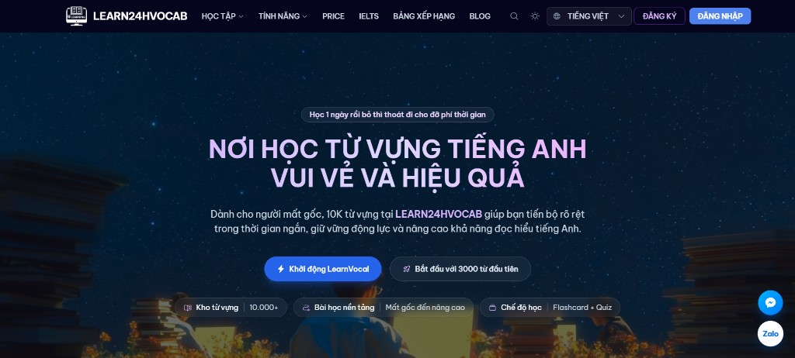
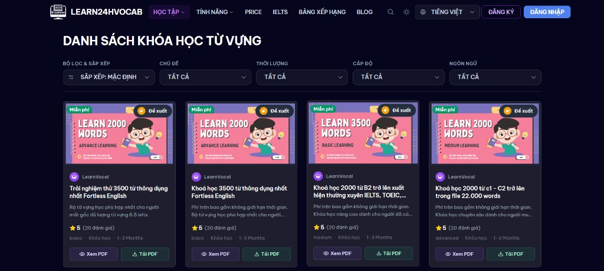
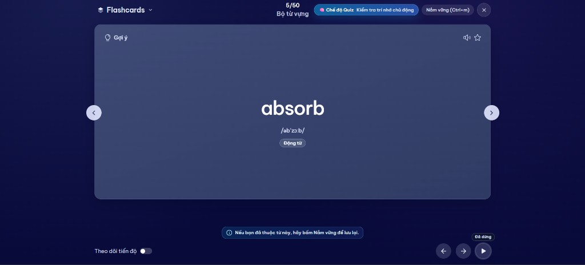
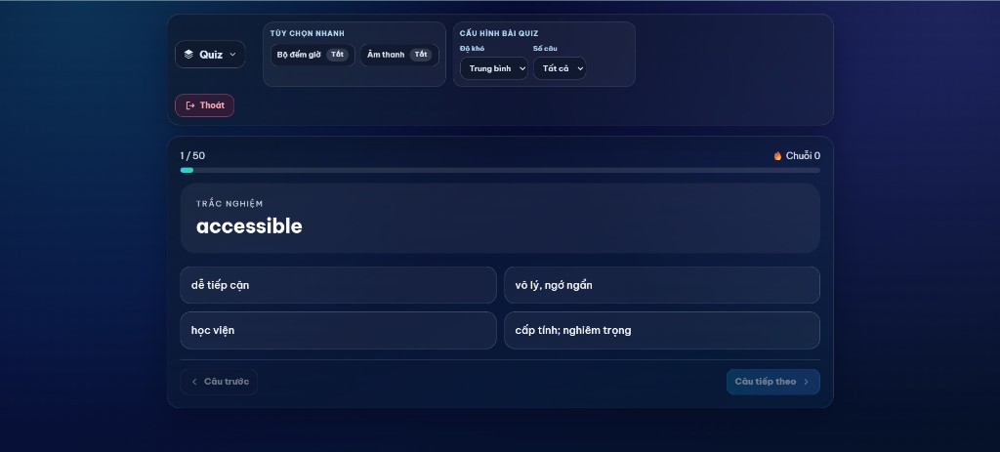
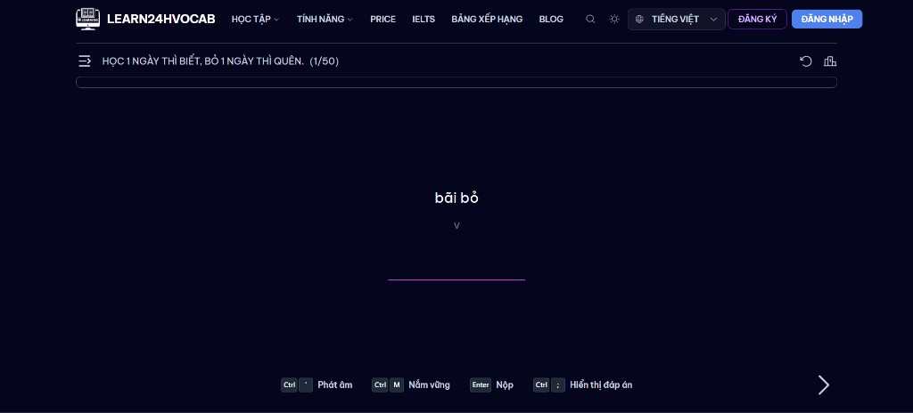
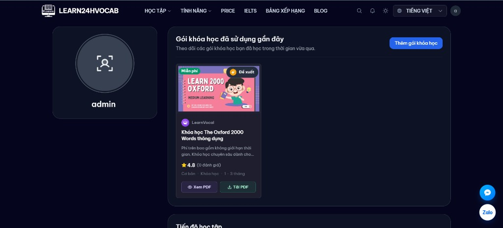
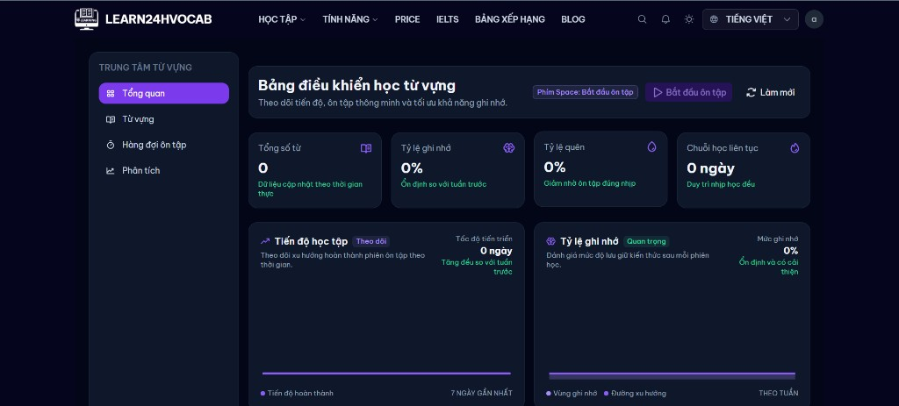

# LEARN24HVOCAB.ONLINE

<p align="center">
  
</p>

<p align="center">
  Giao diện Learn24Vocab - nền tảng học từ vựng tiếng Anh trực quan, hiện đại.
</p>

## Screenshots

### Danh sách khóa học

<p align="center">
  
</p>

### Chế độ học Flashcard

<p align="center">
  
</p>

### Chế độ Quiz trắc nghiệm

<p align="center">
  
</p>

### Chế độ học gõ từ (Typing)

<p align="center">
  
</p>

### Hồ sơ học tập cá nhân

<p align="center">
  
</p>

### Bảng điều khiển trung tâm từ vựng

<p align="center">
  
</p>


Nền tảng học từ vựng với kiến trúc tách lớp rõ ràng: API backend, client web, dashboard quản trị, cùng quy trình triển khai production bằng Docker Compose.

README này đóng vai trò **nguồn tài liệu chính thức** cho đội phát triển và vận hành: từ chạy local, build image, CI/CD, triển khai server, cấu hình domain, đến xử lý sự cố thường gặp.

---

## Mục lục

- [1. Tổng quan hệ thống](#1-tổng-quan-hệ-thống)
- [2. Kiến trúc dịch vụ & cổng](#2-kiến-trúc-dịch-vụ--cổng)
- [3. Yêu cầu môi trường](#3-yêu-cầu-môi-trường)
- [4. Cấu hình môi trường](#4-cấu-hình-môi-trường)
- [5. Chạy local bằng Docker Compose](#5-chạy-local-bằng-docker-compose)
- [6. Build & push image (CI/CD)](#6-build--push-image-cicd)
- [7. Triển khai production trên server](#7-triển-khai-production-trên-server)
- [8. Migrate và seed dữ liệu (không cần source code trên server)](#8-migrate-và-seed-dữ-liệu-không-cần-source-code-trên-server)
- [9. Cấu hình Nginx + domain](#9-cấu-hình-nginx--domain)
- [10. Vận hành và kiểm tra sau deploy](#10-vận-hành-và-kiểm-tra-sau-deploy)
- [11. Sự cố thường gặp](#11-sự-cố-thường-gặp)
- [12. Bảo mật & best practices](#12-bảo-mật--best-practices)
- [13. Đóng góp phát triển](#13-đóng-góp-phát-triển)

---

## 1. Tổng quan hệ thống

learn24hvocab gồm 5 nhóm thành phần chính:

1. **API (`apps/api`)**: backend xử lý nghiệp vụ, auth proxy, thanh toán, dữ liệu học tập.
2. **Client (`apps/client`)**: giao diện người học (Nuxt static + Nginx).
3. **Dash (`apps/dash`)**: dashboard quản trị (Nuxt static + Nginx), chạy dưới subpath `/dash/`.
4. **PostgreSQL**: lưu trữ dữ liệu chính.
5. **Redis**: cache/session/queue tạm thời.

Điểm nổi bật:

- Triển khai độc lập từng service qua Docker image.
- Hỗ trợ quy trình migrate/seed bằng `ops image`, không cần clone source trên server.
- Tương thích Nginx reverse proxy cho domain production.
- Có thể mở rộng CI/CD để push đồng thời GHCR và Docker Hub.

---

## 2. Kiến trúc dịch vụ & cổng

Mặc định production:

- `api`: container `3001` -> host `3001`
- `client`: container `80` -> host `3000`
- `dash`: container `80` -> host `3002`
- `db` (Postgres): container `5432` -> host `5433`
- `redis`: container `6379` -> host `6379`

Ví dụ routing qua domain:

- `/` -> `client`
- `/dash/` -> `dash`
- `/api/` -> `api`

---

## 3. Yêu cầu môi trường

### 3.1 Local development

- Node.js `>= 18`
- pnpm `>= 8`
- Docker + Docker Compose plugin

### 3.2 Production server

- Ubuntu/Debian (khuyến nghị)
- Docker Engine + Docker Compose plugin
- Nginx
- Domain đã trỏ DNS về server

---

## 4. Cấu hình môi trường

> Khuyến nghị đặt file env API tại `apps/api/.env`.

Ví dụ tối thiểu:

```env
DATABASE_URL="postgres://postgres:<POSTGRES_PASSWORD>@db:5432/learn24hvocab"
SECRET="<RANDOM_STRONG_SECRET>"
REDIS_URL="redis://redis:6379"

LEARN24H_AUTH_BASE="https://learn24h.online"
BACKEND_ENDPOINT="http://localhost:3001/"

MOMO_PARTNER_CODE=""
MOMO_PARTNER_NAME=""
MOMO_ACCESS_KEY=""
MOMO_SECRET_KEY=""
MOMO_ENDPOINT_CREATE="https://payment.momo.vn/v2/gateway/api/create"
MOMO_ENDPOINT_QUERY="https://payment.momo.vn/v2/gateway/api/query"
MOMO_STORE_ID=""
MOMO_REDIRECT_URL="https://<your-domain>/course-pack"
MOMO_IPN_URL="https://<your-domain>/api/payment/momo/ipn"
```

Lưu ý quan trọng:

- Luôn dùng format `KEY="VALUE"` để tránh lỗi parser khi có ký tự đặc biệt.
- Trong Docker network:
  - host DB là `db`
  - host Redis là `redis`
- Không commit `.env` thật lên repository.

---

## 5. Chạy local bằng Docker Compose

1) Tạo `.env` cho API theo mẫu ở trên.

2) Chạy các service chính:

```bash
docker compose -f docker-compose.prod.yml up -d db redis api client dash
docker compose -f docker-compose.prod.yml ps
```

3) Kiểm tra nhanh:

- Client: `http://localhost:3000`
- Dash: `http://localhost:3002/dash/` hoặc `http://localhost:3002`
- API Swagger: `http://localhost:3001/swagger`

---

## 6. Build & push image (CI/CD)

Dự án hỗ trợ build/push nhiều image:

- `learn24hvocab-api`
- `learn24hvocab-client`
- `learn24hvocab-dash`
- `learn24hvocab-ops` (dùng cho migrate/seed)

### 6.1 Secrets cần có trên GitHub Actions

Trong `Settings -> Secrets and variables -> Actions`:

- `DOCKERHUB_USERNAME`
- `DOCKERHUB_TOKEN`

### 6.2 Kết quả image ví dụ

- `docker.io/<namespace>/learn24hvocab-api:latest`
- `docker.io/<namespace>/learn24hvocab-client:latest`
- `docker.io/<namespace>/learn24hvocab-dash:latest`
- `docker.io/<namespace>/learn24hvocab-ops:latest`

---

## 7. Triển khai production trên server

### 7.1 Chuẩn bị thư mục deploy

```bash
mkdir -p /opt/learn24hvocab/apps/api
cd /opt/learn24hvocab
```

Tối thiểu cần có:

- `docker-compose.prod.yml`
- `apps/api/.env`

### 7.2 Export biến cần thiết

```bash
export POSTGRES_PASSWORD='<strong_password>'
export IMAGE_TAG='latest'
```

### 7.3 Pull và chạy services

```bash
docker compose -f docker-compose.prod.yml pull client dash api
docker compose -f docker-compose.prod.yml up -d db redis api client dash
docker compose -f docker-compose.prod.yml ps
```

---

## 8. Migrate và seed dữ liệu (không cần source code trên server)

Quy trình chuẩn bằng `ops image`:

```bash
docker compose -f docker-compose.prod.yml --profile ops run --rm migrate
docker compose -f docker-compose.prod.yml --profile ops run --rm seed
docker compose -f docker-compose.prod.yml restart api
```

Ý nghĩa:

- `migrate`: khởi tạo/cập nhật schema DB.
- `seed`: nạp dữ liệu khởi tạo.
- `restart api`: đảm bảo backend dùng schema mới nhất.

---

## 9. Cấu hình Nginx + domain

Ví dụ domain `learn24hvocab.online`:

- `/` reverse proxy về `127.0.0.1:3000`
- `/dash/` reverse proxy về `127.0.0.1:3002/`
- `/api/` reverse proxy về `127.0.0.1:3001/`

Yêu cầu quan trọng cho dash:

- phải có redirect `/dash -> /dash/`
- phải build dash với `baseURL=/dash/` để tránh lỗi asset `/_nuxt/*` 404

Sau khi tạo config:

```bash
sudo nginx -t && sudo systemctl reload nginx
```

Kích hoạt HTTPS:

```bash
sudo apt install -y certbot python3-certbot-nginx
sudo certbot --nginx -d <your-domain> -d www.<your-domain>
```

---

## 10. Vận hành và kiểm tra sau deploy

### 10.1 Health checks cơ bản

```bash
curl -I "http://127.0.0.1:3001/swagger"
curl -I "http://127.0.0.1:3000"
curl -I "http://127.0.0.1:3002"
curl -I "http://127.0.0.1:3000/api/swagger"
curl -I "http://127.0.0.1:3002/api/swagger"
```

Nếu đã bật SSL:

```bash
curl -I "https://<your-domain>/"
curl -I "https://<your-domain>/dash/"
curl -I "https://<your-domain>/api/swagger"
```

### 10.2 Log nhanh khi có lỗi

```bash
docker compose -f docker-compose.prod.yml logs --tail 200 api
docker compose -f docker-compose.prod.yml logs --tail 200 client
docker compose -f docker-compose.prod.yml logs --tail 200 dash
```

---

## 11. Sự cố thường gặp

### 11.1 `relation "... " does not exist`

Nguyên nhân: chưa chạy migrate.  
Khắc phục:

```bash
docker compose -f docker-compose.prod.yml --profile ops run --rm migrate
docker compose -f docker-compose.prod.yml restart api
```

### 11.2 `pnpm: command not found` hoặc `No package.json found`

Nguyên nhân: chạy lệnh pnpm trên host không có source code.  
Khắc phục: chỉ chạy migrate/seed qua `ops` container.

### 11.3 `password authentication failed for user "postgres"`

Nguyên nhân:

- `POSTGRES_PASSWORD` chưa export đúng
- `DATABASE_URL` sai password
- volume DB cũ còn giữ credential cũ

Khắc phục:

- kiểm tra lại env
- nếu cần reset hoàn toàn môi trường dữ liệu: `docker compose down -v` (cân nhắc kỹ vì mất data)

### 11.4 `Cannot find module '@learn24hvocab/schema/dist/index.js'`

Nguyên nhân: schema chưa build trước seed trong image cũ.  
Khắc phục: rebuild/pull image `learn24hvocab-ops` mới rồi chạy lại seed.

### 11.5 `redirect_uri_mismatch` khi Google OAuth

Nguyên nhân: redirect URI thực tế chưa whitelist trong Google Cloud Console.  
Khắc phục: thêm đúng URI callback của môi trường đang dùng (`localhost`, domain chính, `www` nếu có).

---

## 12. Bảo mật & best practices

- Không hard-code secret vào source.
- Tách credentials theo môi trường (dev/staging/prod).
- Giới hạn quyền đọc file env (`chmod 600`).
- Thiết lập backup định kỳ cho Postgres volume.
- Theo dõi logs + metrics để phát hiện lỗi upstream sớm.
- Dùng HTTPS bắt buộc trên production.

---

## 13. Đóng góp phát triển

Đề xuất quy trình làm việc:

1. Tạo branch theo tính năng.
2. Viết code + test cục bộ.
3. Mở Pull Request với mô tả rõ:
   - Mục tiêu thay đổi
   - Rủi ro có thể phát sinh
   - Cách kiểm thử
4. Sau khi merge, theo dõi CI/CD và smoke test production.

---

## Liên hệ vận hành

Nếu cần hỗ trợ khẩn cấp khi deploy:

- Chuẩn bị thông tin: log `api/client/dash`, file compose đang dùng, biến env liên quan.
- Mô tả rõ bước tái hiện lỗi và thời điểm bắt đầu lỗi.

Điều này giúp rút ngắn thời gian xử lý sự cố và hạn chế downtime.
